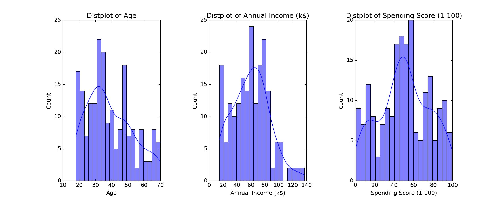
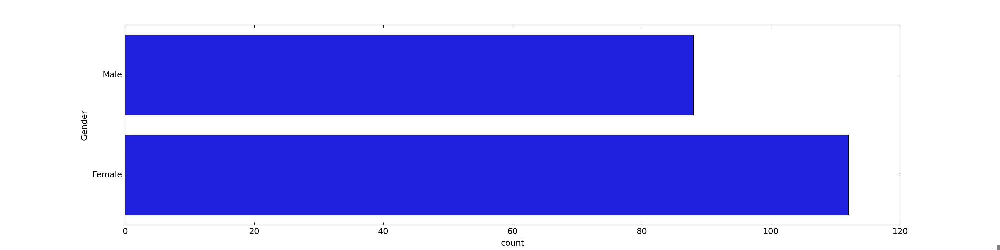
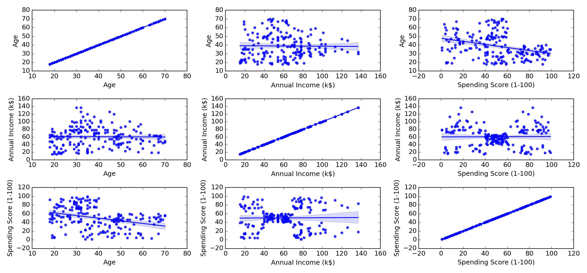
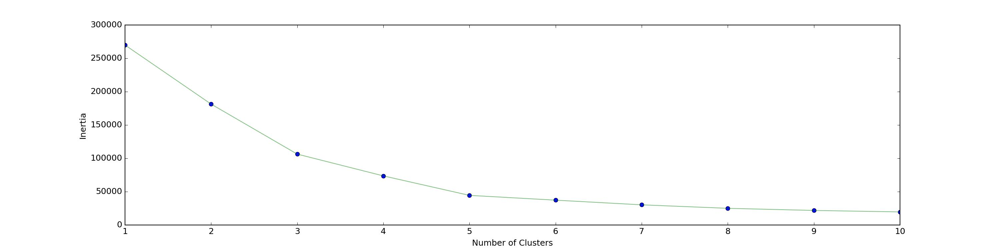
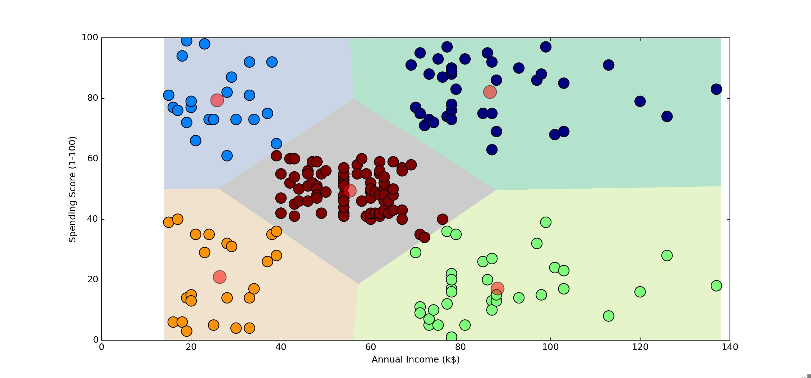

# Customer Segmentation Analysis

## Introduction
This project applies KMeans clustering to segment customers based on their age and spending scores. The analysis flow is documented step-by-step, highlighting key outputs and visualizations to provide insights into customer behavior.

## Project Flow and Outputs

### 1. Data Exploration
We begin with an exploratory data analysis to understand the distribution and relationships in the data. Outputs at this stage include histograms and scatter plots that reveal the spread and range of the age and spending score attributes.

**Outputs:**
- `Histogram of Attribution Distributions`

- `Histogram of Genders`

- `Histogram of Relations Between Attributes`

### 2. Optimal Cluster Determination
Using the elbow method, we calculate the Within-Cluster-Sum of Squared Errors (WSS) for different cluster counts to find the optimal number of clusters.

**Output:**
- `Elbow Method Graph`

The optimal number for clusters based on the elbow plot is 5.

### 3. Cluster Visualization
Clusters are visualized in a 2D space with distinct colors for each cluster. The centroids are marked to show the centers of each cluster.

**Output:**
- `2D Cluster Visualization with Centroids`

### 4. Cluster Analysis
Based on the clustering results, we derive actionable insights and recommendations for targeted marketing strategies.

**Output:**
- `Recommendations Report`

## Tools and Technologies Used
- Python 3
- Jupyter Notebooks
- Libraries: pandas, NumPy, Matplotlib, seaborn, scikit-learn

## How to Run the Project
To reproduce these analyses and visualizations:

1. Clone the repository.
2. Install the dependencies listed in `requirements.txt`.
3. Run the Jupyter notebooks within the `notebooks` directory.
